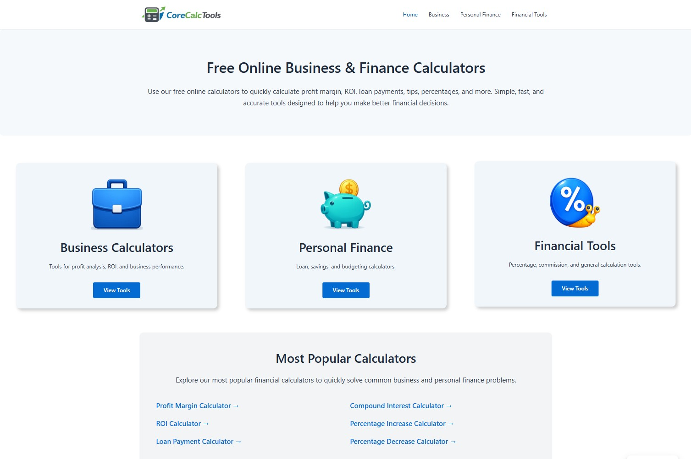
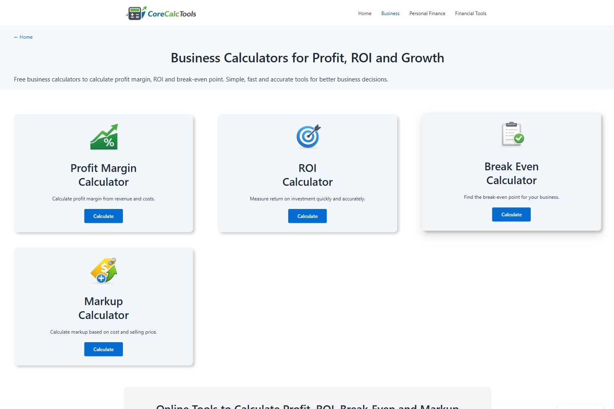
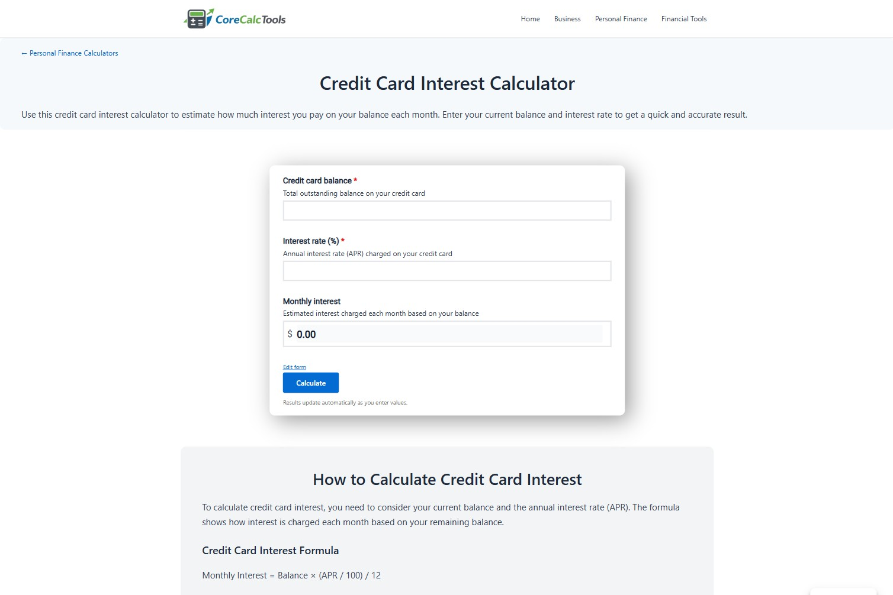

# CoreCalcTools

  

CoreCalcTools is an independent web project focused on providing accurate, fast, and easy-to-use financial tools for everyday use, including loans, interest, and percentage calculations.

The project is centered on practical calculations and includes tools such as:

- Business calculators (ROI, profit margin, break-even, markup)
- Personal finance tools (loan payment, compound interest, credit card interest)
- Percentage and utility calculators
- Everyday financial tools

All tools are designed to be simple, reliable, and accessible for any user.

**CoreCalcTools official website:**

https://corecalctools.com/

## Project status
Actively maintained and expanding content.
Early-stage project focused on building organic visibility.

## Scope
CoreCalcTools focuses on clear and practical tools for users who need quick and reliable financial calculations, whether for personal use or small business decisions.

## Technologies
- WordPress
- Astra (theme)
- Forminator (form & calculator plugin)
- Custom CSS

## Preview

  

 

  

 

  

## Purpose
Personal project focused on building and scaling a niche website based on useful tools and SEO-driven growth.
